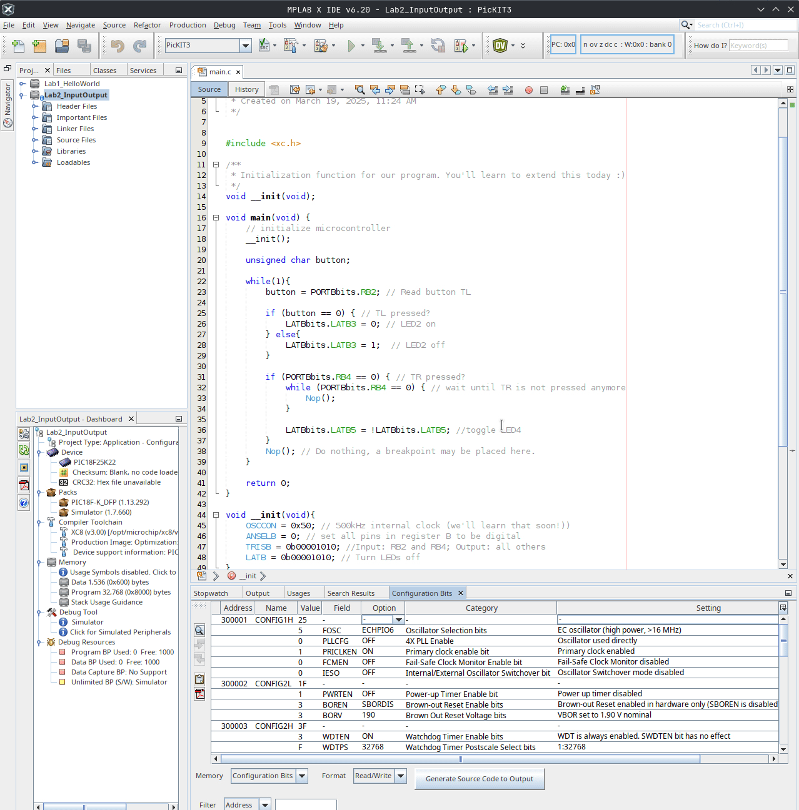
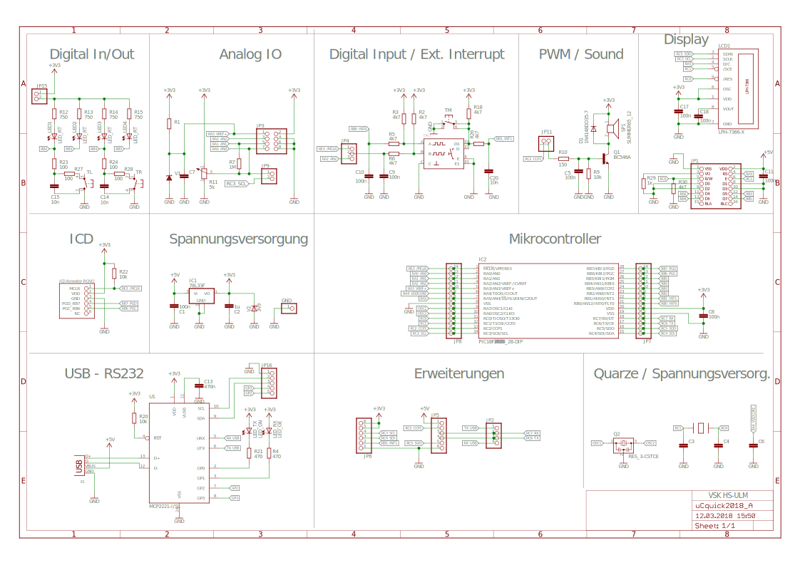

# Lab2_InputOutput

## Excercise 1 -  Code analysis

### Question L.1.1 
Describe the function of the code in main.c in your words using the following keywords (declaration of variables, call of
the function, staying within the loop, checking bits of PORTB, reacting to buttons, ! Logical negation (NOT)).

### Question L.1.2 
Think, what happens, if jumper of LEDs is not set. This might be a trap.
> [!TIP]
> Look at the development board's [schematic](#development-boards-schematic)

## Excercise 2 - Get to know the code (a.k.a. Debugging)
Next, we go through the code step by step , which is called debugging.
You have written your own code or copied highly freaky code from us, but do not fully understand the function.
Not to worry! For this you need an observation tool, the Watch, from the MPLAB X IDE. 
See below video for an instruction on debugging with MPLAB's watch-functionality.

Choose Debug Debug Main
Project from the menu and then Debug->Pause from the menu. Insert the SFR TRISB, LATB and PORTB via Menu
Debug->New Watch. Use Ctrl-F8 (toggle line breakpoint) to set a breakpoint in lines (LATBbits.LATB3 = 0; // LED
2 on) and (LATBbits.LATB5 = !LATBbits.LATB5; // toggle LED 4 ) of the main loop. Observe the registers in the
watch after starting the program with Menu Debugg Debug Main Project or the corresponding symbol in the quick
start bar. Now start the execution of your code by Debug Step over F8 and watch the Watch. The green bar (see
picture on next page) should run step by step through the program. Press the TR and TL keys individually, hold it
and observe the values in PORTB.

| Action| LATB   | PORTB  | LED2  | LED4  |
| :---: |  :---: |  :---: |  :--- |  :--- | 
| no buttons pressed | 0b 0000 0000 | 0b 0001 1110 | off | on |
|press button TL and hold, then F5 to continue program | | | | |
| release the button and press after that F5 | | | | |
| press button TR and hold, then F5, **then press Pause!** | | | | |
| release all buttons, then press F5 | | | | |
| press button TR again and hold, then F5, **then press Pause!** | | | | |
| release all buttons, then press F5  | | | | |
| press button TR again and hold, then F5, **then press Pause!** | | | | |
| release all buttons, then press F5 F5, **then press Pause!** | | | | |

## Development Board's Schematic
[Here](images/uCquick_Board_2018_01.svg) is alink to the standalone schematic (zoomable).

### Relevant registers
> [!IMPORTANT]
> **TRISB** sets the direction of a pin: "`0"' = output, "`1"' = input\\
> **PORTB** reads the logic level at the pin: "`0"' = 0-0.8 V, "`1"' = Vdd (1.6-3.3 V or 2.0-5.0 V for TTL inputs)\\
> **LATB** set the output voltage of a pin: "`0"' = 0 V, "`1"' = Vdd (3.3 V or 5 V)\\
> **ANSELB** sets the pins digital or analog: "`0"' = digital, not necessarry with given configration\\
> **OSCCON** sets the oscillator freq.: 0x50 = 4 MHz, 0x30 = 1 MHz. The instruction freq. are 1 MHz and 250 kHz respectively\\
> **<Register>bits.X** TRISBbits.TRISB3 or LATBbits.LATB3 or PORTBbits.RB3 is the direct access to the bit 3 via a struct (see structures in C).